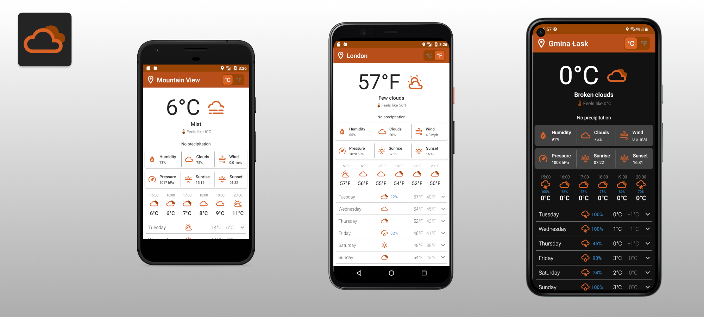

# Weather-App
An Android Weather Application based on OpenWeatherMap One Call API which provides information about current weather and hourly or daily weather forecast.
The application was implemented using MVVM architectural pattern with ViewModel and LiveData and Kotlin Coroutines for async programming,
retrofit2 for working with REST API and Location Requests to get the current location of the user. 

## Status
The application is fully functioning and can be installed on the devices.

## Features
* Show current weather for the user's location. 
* Show hourly and daily forecast.
* Changing and saving units settings.
* Refreshing current location.
* Refreshing weather data.

## Technologies
Application was created with:
* Retrofit2 to retrieve data in JSON from REST based service.
* ViewModel to manage UI-related data.
* LiveData to handle data.
* Kotlin Coroutines to manage background threads.

## Architecture
The architecture of the app is based on the MVVM pattern with the repository and remote data source.

## Instalation
Plant Care app requires a minimum API level of 23.
